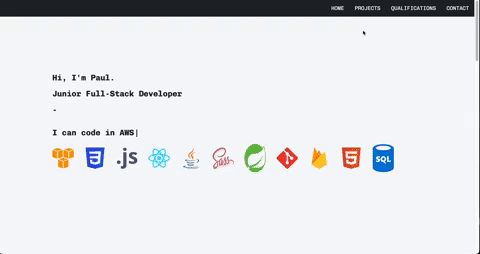

# Portfolio Website

- Reinforce and implementing everything I have learnt so far about front-end development.
  - Implementing HTML, CSS, SCSS, React framework JS.

# Image

# Link

https://personal-website-paultree.vercel.app/

# Setup

- npm i
- Typewriter effect
- React scroll
- react-burger-menu

## MVP

- You need to have it as a public repository on GitHub - [x]
- In the repo you will also need a README.md with a short intro to the project. - [x]
- You are to use SCSS for styling. - [x]
- You are to use B.E.M as a naming convention. - [x]
- !!! Responsiveness is vital – use Grid, Flex, whatever you wish but the site must look good at all screen widths.
  VERY CRITICAL! : You will need to make sure that your website looks good on phones, tablets and laptops (we will see Media Queries next week, docs to follow) - [x]

Your Portfolio should have the following section:

- A landing page/section with your name and title on it. - [x]
- An About page/section with a little bit about you - [x]
- A Tech stacks/skills page/section with all the techs you have learned during the course - [x]
- A Project page/section with all your projects (use placeholder images and text at the beginning to render your website as it would with actual projects) - each project should have a little description, a link to a live version and a link to the matching GitHub Repo (using a README.md at the root of the repo to include how you went about coding for that project) - [x]
- A Contact page/section with your email, GitHub profile link, LinkedIn profile link - [x]

### TIPS:

- Choose a clear, clean, simple colour palette - [x]
- Make sure to have the MVP done with all the different section before adding extra feature (animations, effects, etc) - [x]
- Create a new branch for each section of your page to practice your Git - [x]

### Useful resources:

- [GitHub](https://pages.github.com/)
- [Trendy Color Palette](https://colorhunt.co/palettes/popular)
- [Color Palette Generator](https://coolors.co/generate)
- [Tips For Modible First Design](https://www.invisionapp.com/inside-design/mobile-first-design/)
- [Guide to Mobile First Design](https://css-tricks.com/how-to-develop-and-test-a-mobile-first-design-in-2021/)
- [Gorgeous SVG logos](https://www.vectorlogo.zone/)

# Approach

- Build a SPA application for personal website. - [x]
- A landing page/section with your name and title on it. - [x]
- An About page/section with a little bit about you - [x]
- A Tech stacks/skills page/section with all the techs you have learned during the course - [x]
- A Project page/section with all your projects (use placeholder images and text at the beginning to render your website as it would with actual projects) - each project should have a little description, a link to a live version and a link to the matching GitHub Repo (using a README.md at the root of the repo to include how you went about coding for that project) - [x]
- A Contact page/section with your email, GitHub profile link, LinkedIn profile link - [x]
- Pick one style of naming convention. - [x]
- Make it responsive. - [x]
- Pictures of languages used. - [x]

31/12/2022

- Set up a HomePage which will consist of a small introductory header and an array of programming language icons.
- Will need to implement a solution where hovering on an icon will render the name of the language on the screen somewhere...

5/01/2023

- Set up a projects page, a qualifications page and an about me page with contact info.

# Reflection

# Future Goals

- Swap out the projects.
  - Need to add 1 that displays Java proficiency.
  - Need to add the e-commerce website to demonstrate skills with firebase/firestore + React.
- Add a name tag at top left - left of navbar.

# Further reading

# Stay in touch

# Licence

# Contribution
